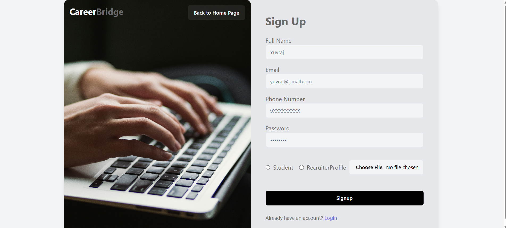
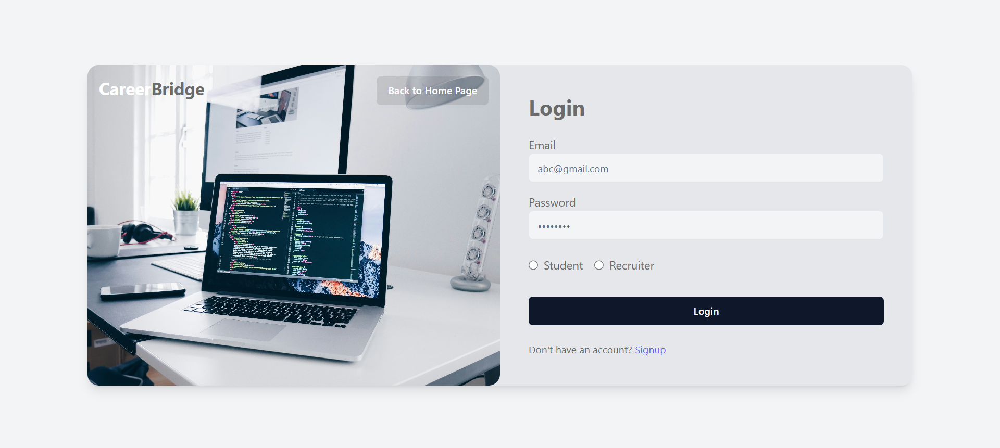
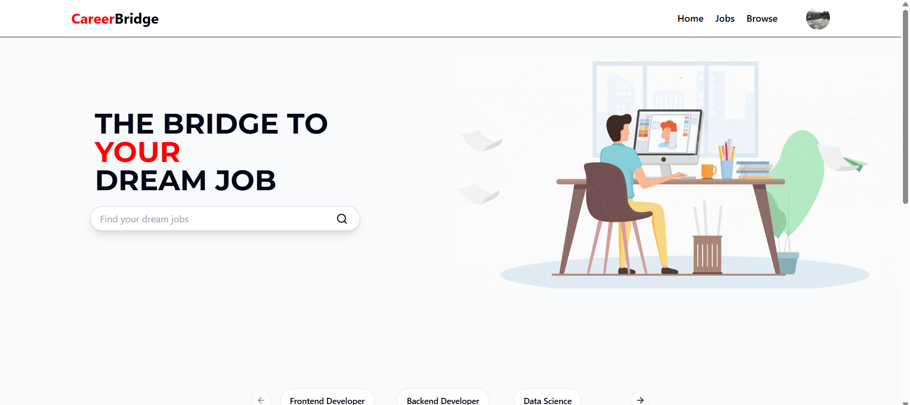
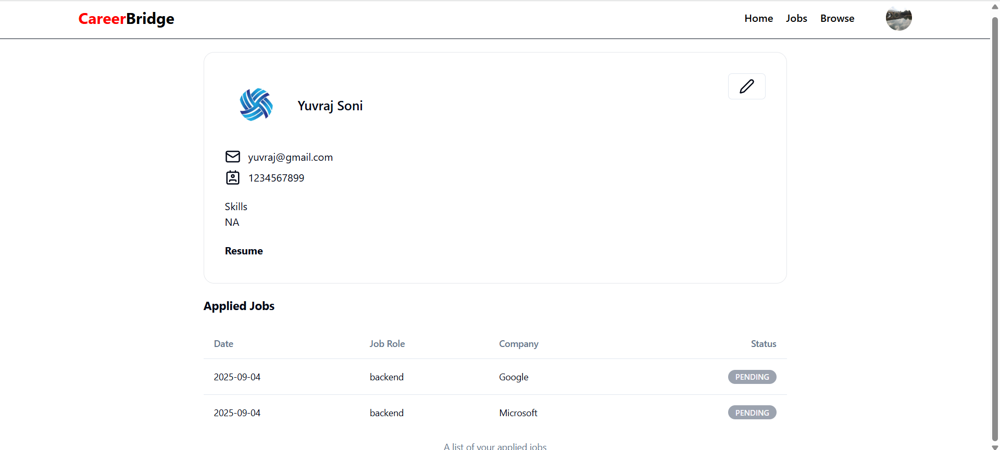
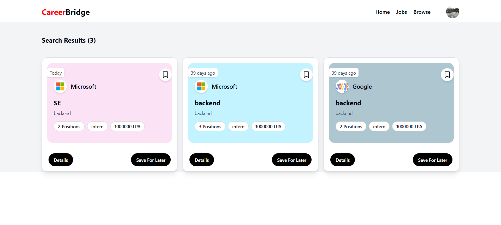
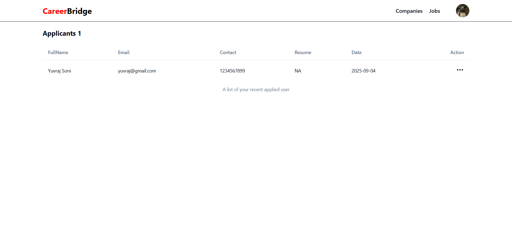

# Job Portal

A web application for managing job postings, applications, and company profiles, built using the MERN stack with Redux and JWT authentication.

---

## 📖 About
This project is a **job portal platform** that allows recruiters to post jobs, manage applications, and view company details, while job seekers can explore and apply to jobs.  
It demonstrates a modern fullstack setup combining **authentication**, **state management**, and a **responsive frontend**.

---

## 🚀 Features
- 🔐 **User authentication** with JWT  
- 👔 **Recruiter dashboard** to post and manage jobs  
- 📝 Job seeker can **view and apply to jobs**  
- 🏢 **Company management**: create, edit, and view company profiles  
- 🗄️ Persistent data storage using MongoDB  
- 📱 Fully **responsive UI**  

---

## 🛠️ Tech Stack

- [MongoDB](https://www.mongodb.com/) – Database for storing users, companies, jobs, and applications  
- [Express.js](https://expressjs.com/) – Backend API framework  
- [React](https://react.dev/) – Frontend UI library  
- [Node.js](https://nodejs.org/) – Backend runtime environment  
- [Redux Toolkit](https://redux-toolkit.js.org/) – State management  
- [JWT (JSON Web Token)](https://jwt.io/) – Secure authentication  

---
# 📸 Screenshots

---

## 📝 Signup

---

## 🔐 Login

---

## 🏠 Landing Page

---

## 👤 User Dashboard

---

## 📋 Job Listings

---

## 🛠️ Admin Panel – Accept/Reject Jobs

---
